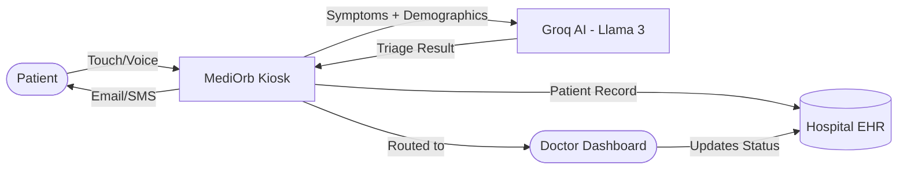
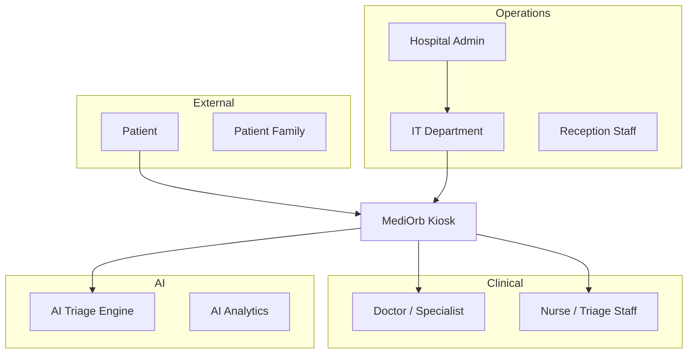
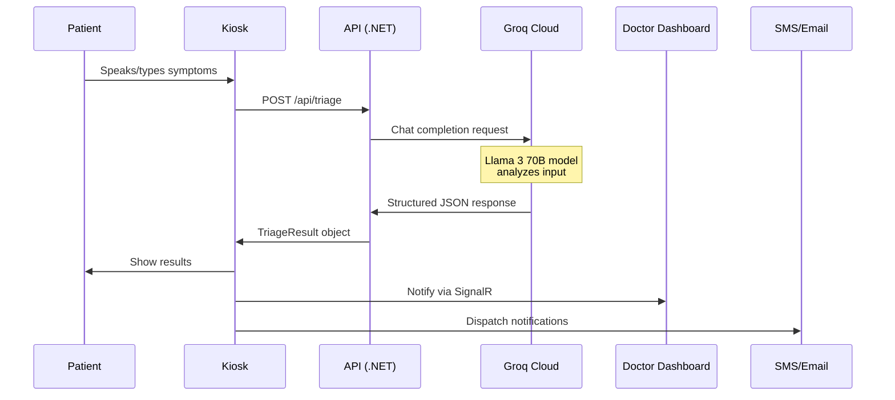

# MediOrb AI Hospital Kiosk — Production System Documentation

> **Version:** 2.0 · **Stack:** .NET Core 8 + Angular 17 · **AI Engine:** Groq Llama 3 70B  
> **Document Type:** Production Architecture & Functional Specification

---

## Table of Contents

1. [System Overview](#1-system-overview)
2. [Stakeholders & Roles](#2-stakeholders--roles)
3. [Patient Flow — End-to-End](#3-patient-flow--end-to-end)
4. [Doctor Flow](#4-doctor-flow)
5. [Admin / Hospital Staff Flow](#5-admin--hospital-staff-flow)
6. [AI Automation Engine](#6-ai-automation-engine)
7. [Production Architecture](#7-production-architecture)
8. [Data Models](#8-data-models)
9. [Security & Compliance](#9-security--compliance)
10. [Integrations](#10-integrations)
11. [Scalability & Performance](#11-scalability--performance)
12. [Deployment Guide](#12-deployment-guide)
13. [Future Roadmap](#13-future-roadmap)

---

## 1. System Overview

**MediOrb** is an AI-powered hospital self-check-in and intelligent triage kiosk. It eliminates the traditional front-desk bottleneck by allowing patients to register, describe symptoms (via voice or text), receive instant AI-generated specialist routing, and get their appointment details dispatched to their phone/email — all in under **60 seconds**.



### Core Value Proposition
| Problem | MediOrb Solution |
|---|---|
| Long queues at reception | Self-service check-in in <60 seconds |
| Wrong department routing | AI-powered specialist matching |
| Language barriers | 3-language support (EN/HI/ES) |
| Accessibility issues | Voice-first, touch-free interface |
| Manual paperwork | Auto-generated digital record |
| No follow-up | Instant email + SMS dispatch |

---

## 2. Stakeholders & Roles



| Role | Access Level | Primary Touchpoint |
|---|---|---|
| **Patient** | Kiosk only | Self-service kiosk screen |
| **Doctor** | Doctor Dashboard | Web portal / mobile app |
| **Nurse / Triage** | Nurse Portal | Queue management screen |
| **Reception Staff** | Admin Panel | Appointment overview |
| **Hospital Admin** | Full Admin | Analytics + configuration |
| **IT Department** | System Config | Deployment + API keys |

---

## 3. Patient Flow — End-to-End

### Step 1: Arrival & Language Selection
- Patient walks up to the kiosk.
- Default language: English. Options: Hindi, Spanish.
- Selecting a language instantly switches **all UI text + voice TTS** to that language.

### Step 2: Patient Registration
**Inputs collected:**
| Field | Validation | Purpose |
|---|---|---|
| Full Name | Required, letters only | Identity |
| Age | 1–120, required | Clinical context |
| Gender | Male/Female/Other | Clinical context |
| Phone (10-digit) | Required, Indian mobile format | SMS dispatch |
| Email | Optional, valid format | Email report |

> All validation happens client-side (Angular Reactive Forms) and server-side (.NET DataAnnotations) simultaneously.

### Step 3: Symptom Capture
**Two input modes are available:**

**Voice Mode (Primary):**
1. Patient taps the AI Orb or mic button.
2. AI Orb switches to "Listening" state (visual + audio cue).
3. Patient speaks naturally: *"I have a fever, headache, and body ache since yesterday."*
4. Real-time transcript appears in the text box.
5. After **6 seconds of silence**, the mic auto-stops.
6. The system automatically submits for analysis.

**Text Mode (Fallback):**
1. Patient types symptoms directly.
2. Quick-select chips for common symptoms: Fever, Headache, Cough, Chest Pain, etc.
3. Patient taps "Analyze with AI" manually.

> **Accessibility Note:** Voice mode works even if the patient cannot read, making the kiosk fully accessible.

### Step 4: AI Triage (Automated)
- AI Orb switches to "Processing" state.
- Groq AI analyzes symptoms in **<2 seconds**.
- Results displayed:
  - **Urgency Level** (Low / Medium / High / Emergency)
  - **Recommended Doctor** (name, specialty, floor, room number)
  - **Estimated Wait Time**
  - **AI Reasoning** (why this doctor was chosen)
  - **Suggested Tests** (e.g., CBC, X-Ray, ECG)

### Step 5: Confirmation & Dispatch
- Patient receives:
  - **Patient ID** (e.g., `PAT-8G5AJCR9H`) — unique per session
  - **Appointment ID** (e.g., `APP-ES5MWA`) — for tracking
  - Floor/Room to walk to
- Automatic dispatch:
  - 📱 **SMS** sent to registered mobile number
  - 📧 **Email** sent with full clinical summary (if email provided)
- Patient can **Download** a `.txt` report.
- Kiosk resets for the next patient.

---

## 4. Doctor Flow

### Real-Time Patient Queue (Doctor Dashboard)

> **Production Feature — requires Doctor Dashboard module**

When a patient completes check-in, the doctor's dashboard is updated in **real-time** via WebSocket/SignalR:

```
New Patient Alert:
┌──────────────────────────────────────────────┐
│ 🔴 HIGH PRIORITY                              │
│ Patient: Kajal Kumari (Age: 28, Female)       │
│ Symptoms: Chest pain, shortness of breath     │
│ AI Routing: Cardiologist — Floor 3, Room 301  │
│ Wait Time: 5-10 minutes                       │
│ AI Reasoning: Possible cardiac event...       │
│ Suggested Tests: ECG, Troponin, Chest X-Ray   │
│ Appointment ID: APP-ES5MWA                    │
└──────────────────────────────────────────────┘
```

### Doctor Actions
| Action | Description |
|---|---|
| **Accept Patient** | Marks patient as "In Consultation" |
| **Redirect Patient** | Reassign to different specialist |
| **Add Notes** | Add pre-consultation notes |
| **Mark Complete** | Closes the appointment |
| **Order Tests** | Send test request to lab |
| **Access History** | View patient's past visits (if registered) |

### Doctor Notification Channels
- **In-App alert** on Doctor Dashboard
- **SMS notification** when Emergency-level patient arrives
- **Email digest** with daily patient queue summary

---

## 5. Admin / Hospital Staff Flow

### Reception Staff View
- See all checked-in patients in real-time
- Filter by urgency level, department, doctor
- Manually override AI routing if needed
- Print patient slip

### Nurse / Triage Station
- Validates AI urgency classification
- Takes vitals and updates record
- Can escalate or downgrade urgency
- Triggers room/bed assignment

### Hospital Admin Dashboard
| Feature | Description |
|---|---|
| **Live Queue Monitor** | Real-time patient flow across all departments |
| **AI Accuracy Reports** | How often AI routing was accepted vs overridden |
| **Wait Time Analytics** | Average wait per department, per hour |
| **Language Usage Stats** | Which languages patients use most |
| **Doctor Workload** | Patients per doctor, per day |
| **Kiosk Health Monitor** | Uptime, error rates per kiosk unit |
| **Symptom Heatmap** | Most common symptoms by time of day/week |

---

## 6. AI Automation Engine

### How the AI Triage Works



### AI Prompt Engineering
The Groq model receives:
```
System: You are a hospital triage AI. Analyze and return structured JSON only.

User: 
Patient: Female, Age 28
Symptoms: "chest pain and shortness of breath since morning"
Language: English
```

The model returns:
```json
{
  "urgencyLevel": "High",
  "recommendedDoctor": {
    "name": "Dr. Priya Sharma",
    "specialty": "Cardiologist",
    "floor": "Floor 3",
    "room": "Room 301",
    "available": true
  },
  "estimatedWaitTime": "5-10 minutes",
  "reasoning": "Chest pain combined with shortness of breath in a female patient requires immediate cardiac evaluation to rule out ACS.",
  "suggestedTests": ["ECG", "Troponin", "Chest X-Ray"],
  "additionalNotes": "Avoid patient exertion. Seat immediately."
}
```

### AI Automation Rules (Production)

| Urgency | Auto-Action |
|---|---|
| **Emergency** | Alert on-duty doctor immediately, unlock emergency room, call nurse |
| **High** | Notify specialist, move to front of queue |
| **Medium** | Standard queue placement, SMS patient |
| **Low** | Regular queue, patient can wait in lobby |

### AI Quality Assurance
- Every AI triage result is stored with the original symptoms.
- Doctors can mark if the AI recommendation was correct.
- The system tracks **AI accuracy rate** over time.
- Cases where doctors override the AI are flagged for model review.

---

## 7. Production Architecture

```
┌─────────────────────────────────────────────────────┐
│                    CLIENT LAYER                      │
│  Angular Kiosk SPA      Doctor Dashboard (Angular)  │
│  (Touch/Voice/Tablet)   Admin Panel (Angular)        │
└──────────────┬──────────────────────┬───────────────┘
               │ HTTPS                │ WebSocket (SignalR)
┌──────────────▼──────────────────────▼───────────────┐
│               API LAYER (.NET Core 8)                │
│  ┌────────────────┐  ┌────────────────┐              │
│  │TriageController│  │NotifyController│              │
│  └────────┬───────┘  └───────┬────────┘              │
│           │                  │                       │
│  ┌────────▼───────┐  ┌───────▼────────┐              │
│  │  GroqService   │  │  EmailService  │              │
│  │  SmsService    │  │  SignalR Hub   │              │
│  └────────────────┘  └────────────────┘              │
└──────────────┬──────────────────────────────────────┘
               │
┌──────────────▼──────────────────────────────────────┐
│                EXTERNAL SERVICES                     │
│  Groq API          Resend API        Twilio SMS      │
│  (Llama 3 70B)     (Email)           (SMS)           │
└─────────────────────────────────────────────────────┘
               │
┌──────────────▼──────────────────────────────────────┐
│                  DATA LAYER                          │
│  SQL Server (primary DB)    Redis (session/cache)   │
│  EHR Integration (HL7/FHIR) Azure Blob (reports)    │
└─────────────────────────────────────────────────────┘
```

### Technology Choices (Production)

| Layer | POC | Production |
|---|---|---|
| Frontend | Angular 17 | Angular 17 + PWA |
| Backend | ASP.NET Core 8 | ASP.NET Core 8 + SignalR |
| AI | Groq REST API | Groq + fallback to Azure OpenAI |
| Database | In-memory (POC) | SQL Server / Azure SQL |
| Cache | None | Redis |
| Queue | None | Azure Service Bus |
| Auth | None | Azure AD B2C / JWT |
| Storage | None | Azure Blob Storage |
| Monitoring | Console logs | Application Insights |

---

## 8. Data Models

### Patient Record
```json
{
  "patientId": "PAT-8G5AJCR9H",
  "appointmentId": "APP-ES5MWA",
  "name": "Kajal Kumari",
  "age": 28,
  "gender": "female",
  "contact": "9876543210",
  "email": "kajal@example.com",
  "language": "English",
  "registeredAt": "2026-03-23T18:05:10+05:30",
  "kioskId": "KIOSK-001"
}
```

### Triage Result Record
```json
{
  "triageId": "TRG-X7K2M9",
  "patientId": "PAT-8G5AJCR9H",
  "symptoms": "chest pain and shortness of breath since morning",
  "urgencyLevel": "High",
  "recommendedDoctor": { ... },
  "estimatedWaitTime": "5-10 minutes",
  "reasoning": "...",
  "suggestedTests": ["ECG", "Troponin"],
  "doctorAccepted": true,
  "aiWasCorrect": true,
  "triageTimestamp": "2026-03-23T18:05:22+05:30",
  "completedAt": null
}
```

### Appointment Lifecycle
```
CREATED → CHECKED_IN → CALLED → IN_CONSULTATION → TESTS_ORDERED → COMPLETED
                     ↕
                  ESCALATED (Emergency override)
```

---

## 9. Security & Compliance

### Authentication & Authorization
| User Type | Auth Method |
|---|---|
| Patients (Kiosk) | No auth — public kiosk flow |
| Doctors | JWT + Azure AD / SSO |
| Nurses | JWT + Role-based access |
| Admins | MFA + Azure AD B2C |

### Data Security
- All API calls over **HTTPS/TLS 1.3**
- Patient data encrypted **at rest** (AES-256) and **in transit**
- API keys stored in **Azure Key Vault** — never in code
- Kiosk session data **auto-cleared** between patients
- No patient data stored in browser localStorage

### Healthcare Compliance
| Standard | How MediOrb Addresses It |
|---|---|
| **DPDP Act 2023** (India) | Patient consent capture, data minimization |
| **HL7 FHIR** | Standard medical data format for EHR export |
| **ISO 27001** | Security management principles followed |
| **HIPAA-aligned** | Access logs, audit trails, encryption |

### Audit Trail
Every action in the system is logged:
```
[2026-03-23 18:05:10] PATIENT_REGISTERED | PAT-8G5AJCR9H | KIOSK-001
[2026-03-23 18:05:22] TRIAGE_COMPLETED   | PAT-8G5AJCR9H | Urgency=High | AI=GroqLlama3
[2026-03-23 18:05:23] EMAIL_SENT         | kajal@example.com | Status=Delivered
[2026-03-23 18:08:45] DOCTOR_ACCEPTED    | DR-PRIYA | PAT-8G5AJCR9H
```

---

## 10. Integrations

### Current Integrations (POC)
| Service | Purpose | Status |
|---|---|---|
| **Groq API** | AI triage via Llama 3 70B | ✅ Live |
| **Resend API** | Email report dispatch | ✅ Live |
| **Web Speech API** | Voice input + TTS | ✅ Live (browser-native) |
| **SMS** | Patient notification | 🟡 Mock (ready for Twilio) |

### Production Integrations Roadmap
| Service | Purpose | Priority |
|---|---|---|
| **Twilio** | Real SMS dispatch | High |
| **HL7 FHIR API** | EHR sync (Apollo/Fortis/PHIS) | High |
| **Azure SignalR** | Real-time doctor alerts | High |
| **Azure Key Vault** | Secrets management | High |
| **Application Insights** | Monitoring + alerting | Medium |
| **Azure AD B2C** | Doctor/Admin SSO | Medium |
| **Razorpay / Payment** | OPD fee payment at kiosk | Medium |
| **Lab System API** | Auto-raise test orders | Low |
| **Prescription API** | Digital prescription post-consultation | Low |

---

## 11. Scalability & Performance

### Kiosk Deployment Scale
```
Small Hospital:     2–5  kiosk units
District Hospital:  5–10 kiosk units
Super Specialty:   10–20 kiosk units
```

### Performance Targets

| Metric | Target |
|---|---|
| Time-to-triage (voice → results) | < 8 seconds |
| AI inference latency (Groq) | < 2 seconds |
| API response time (p99) | < 500ms |
| Kiosk boot time | < 5 seconds |
| Concurrent kiosk sessions | 100+ per server |
| Uptime SLA | 99.9% |

### Scaling Strategy
- **Horizontal scaling**: Multiple API instances behind Azure Load Balancer
- **Caching**: Redis for doctor availability, department info
- **Queue**: Azure Service Bus for notification dispatch (email/SMS) 
- **CDN**: Angular app served via Azure CDN for global speed
- **Database**: Azure SQL with read replicas for reporting queries

---

## 12. Deployment Guide

### Development Environment
```bash
# Backend
cd MediOrb.API
dotnet run
# → http://localhost:5001

# Frontend
cd MediOrb.Web
ng serve
# → http://localhost:4200
```

### Production Environment (Azure)

**Step 1: Provision Resources**
- Azure App Service (API)
- Azure Static Web Apps (Angular)
- Azure SQL Database
- Azure Redis Cache
- Azure Key Vault
- Azure Application Insights

**Step 2: Configure Secrets**
```bash
# Store secrets in Azure Key Vault (never in appsettings.json)
az keyvault secret set --vault-name MediOrbVault --name GroqApiKey --value "gsk_..."
az keyvault secret set --vault-name MediOrbVault --name ResendApiKey --value "re_..."
az keyvault secret set --vault-name MediOrbVault --name TwilioAuthToken --value "..."
```

**Step 3: Deploy API**
```bash
dotnet publish -c Release -o ./publish
az webapp deploy --resource-group MediOrb-RG --name mediorb-api --src-path ./publish
```

**Step 4: Deploy Angular SPA**
```bash
ng build --configuration production
az staticwebapp deploy --name mediorb-web --app-location ./dist/mediorb-web
```

**Step 5: Configure CORS**
- Allow only the kiosk domain in CORS policy
- Never allow `*` in production

### Kiosk Hardware Setup (Physical Deployment)
```
Recommended Kiosk Spec:
├── Display: 32" Touch-enabled monitor (portrait mode)
├── OS: Windows 10 IoT / Ubuntu 22.04 LTS
├── Browser: Chromium (kiosk mode, --kiosk flag)
├── Microphone: Built-in or external cardioid mic
├── Speaker: 2x stereo speakers for TTS voice
├── Network: Ethernet (primary) + WiFi (backup)
├── Enclosure: Freestanding or wall-mounted cabinet
└── Sanitizer: UV-C hand sanitizer dispenser (optional)

Launch Command (Chromium Kiosk Mode):
chromium --kiosk --disable-restore-session-state http://localhost:4200
```

---

## 13. Future Roadmap

### Phase 1 (Current POC) ✅
- [x] 5-step kiosk flow
- [x] AI triage via Groq
- [x] Voice input with silence detection
- [x] Multilingual support (EN/HI/ES)
- [x] Email dispatch (Resend)
- [x] SMS mock

### Phase 2 (MVP — 3 months)
- [ ] Doctor Dashboard (real-time queue)
- [ ] SMS via Twilio (real)
- [ ] SQL Server patient record storage
- [ ] Azure SignalR for live doctor alerts
- [ ] Doctor JWT authentication
- [ ] Nurse triage override panel
- [ ] OPD fee payment at kiosk

### Phase 3 (Production — 6 months)
- [ ] EHR integration (HL7 FHIR)
- [ ] Multi-kiosk central management
- [ ] AI accuracy feedback loop
- [ ] Admin analytics dashboard
- [ ] Camera-based queue number system
- [ ] QR code appointment ticket print

### Phase 4 (Scale — 12 months)
- [ ] Mobile app (patient self-check-in before arrival)
- [ ] AI vitals estimation (facial analysis for SpO2, HR)
- [ ] Multilingual expansion (Tamil, Bengali, Marathi)
- [ ] Prescription + lab integration
- [ ] Insurance pre-authorization AI
- [ ] Telemedicine routing for rural patients

---

## Summary Table

| Feature | Status | Notes |
|---|---|---|
| Patient Registration | ✅ Production-ready | Validated form, all languages |
| AI Triage | ✅ Production-ready | Groq Llama 3, <2s response |
| Voice Input | ✅ Production-ready | Web Speech API, silence detection |
| TTS Greeting | ✅ Production-ready | Browser-native, 3 languages |
| Email Report | ✅ Production-ready | Resend API, branded template |
| SMS Dispatch | 🟡 Mock | Ready for Twilio integration |
| Doctor Dashboard | 🔴 Planned | Phase 2 |
| EHR Sync | 🔴 Planned | Phase 3 |
| Admin Analytics | 🔴 Planned | Phase 3 |
| Payment at Kiosk | 🔴 Planned | Phase 2 |

---

*Document prepared for MediOrb AI Hospital Kiosk POC · Version 2.0 · March 2026*
